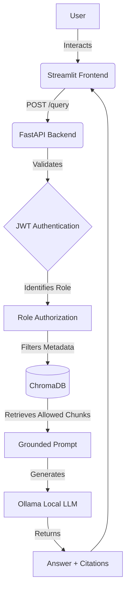

# School Knowledge RAG Assistant

A Role-Based AI School Knowledge System for "Future Scholars International School". This project demonstrates a secure, production-style Retrieval-Augmented Generation (RAG) architecture using local LLMs.

## Project Overview

This web application allows authenticated users to ask questions about school knowledge. The core feature is **Role-Based Access Control before retrieval**. 
- **Students** can access shared and student-specific knowledge.
- **Teachers** can access shared, student, and teacher-specific knowledge.
Teacher-only documents (e.g., grading policies, test administration) are NEVER retrieved for a student.

## Architecture Diagram



## Tech Stack
- **Python 3.10+**
- **Embeddings**: `all-MiniLM-L6-v2` via SentenceTransformers
- **Vector Store**: ChromaDB (Persistent)
- **LLM**: Ollama (`llama3` or similar local model)
- **Backend**: FastAPI, Pydantic, Passlib, python-jose (JWT)
- **Frontend**: Streamlit
- **Testing**: Pytest

## Project Structure
```
school-rag-assistant/
├── backend/               # FastAPI backend
├── data/                  # Synthetic dataset, manifest, and ChromaDB vector store
├── frontend/              # Streamlit frontend
├── notebooks/             # RAG pipeline notebook
├── .env.example           # Example environment variables
├── Dockerfile             # Backend docker image
└── docker-compose.yml     # Services composition
```

## Dataset Description
The dataset contains 32 synthetic documents created for "Future Scholars International School" for the 2026-2027 academic year. 
- **Shared Documents**: General policies, schedules, curricula.
- **Student Documents**: Study guides, activities, FAQs.
- **Teacher Documents**: Grading policies, assessment guidelines, staff procedures.

## Security Model
Authorization happens *before* retrieval. The backend identifies the user's role from the JWT, determines allowed document access levels, and applies a `where` filter to the ChromaDB query. This guarantees that unauthorized chunks are never presented to the LLM.

## Setup & Installation

### 1. Requirements
Ensure Python 3.10+ is installed. Ensure [Ollama](https://ollama.com/) is installed and running locally with the `llama3` model (`ollama run llama3`).

### 2. Environment
Create a virtual environment and install dependencies:
```bash
python -m venv .venv
source .venv/bin/activate  # Or .venv\Scripts\activate on Windows
pip install -r backend/requirements.txt
pip install -r frontend/requirements.txt
```

### 3. Generate the Dataset and Vector Store
Run the provided generation scripts to build the markdown files and populate ChromaDB:
```bash
python generate_dataset.py
jupyter nbconvert --to notebook --execute notebooks/rag_pipeline.ipynb
```
*(Alternatively, you can just run `rag_pipeline.ipynb` in your IDE.)*

### 4. Configuration
Copy the `.env.example` files to `.env` in both `backend/` and `frontend/` directories and configure if needed.

### 5. Running the Backend
```bash
cd backend
uvicorn app.main:app --reload
```
The API will be available at `http://localhost:8000`. Test it by visiting `http://localhost:8000/health`.

### 6. Running the Frontend
In a new terminal window:
```bash
cd frontend
streamlit run app.py
```
Log in with demo credentials:
- **Student**: `student@example.com` / `password123`
- **Teacher**: `teacher@example.com` / `password123`

## Evaluation
Run tests with:
```bash
cd backend
pytest tests/
```

Security tests are evaluated within the notebook and confirm that cross-role data leakage is strictly prohibited. Out-of-scope questions are met with a grounded refusal.
